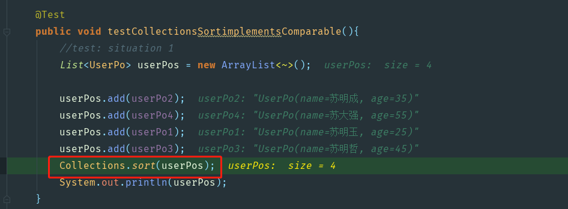
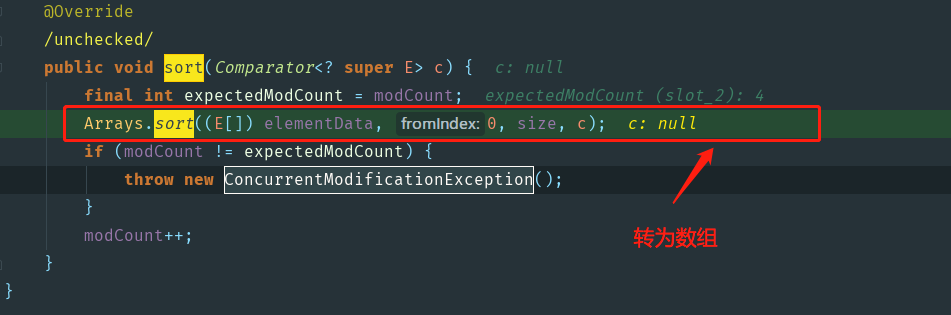

debug走一波.....

##### 1.`debug`---->`testCollectionsSortimplementsComparable`()

##### 2.调取`Collections.sort()`

-1555577916109.png)

`Collections.sort()`调取`list.sort()`方法。也就是`Collections.sort()`方法用作`List`集合的排序


##### 3.进入`list.sort()`->`java.util.ArrayList#sort`(由于创建的是`ArrayList`对象，所以直接跳入`ArrayList`的`sort()`,`ArrayList.sort()`重写`List.sort()`的方法)



##### 4.[重点]`java.util.Arrays#sort(T[], int, int, java.util.Comparator<? super T>)`

.png)

### 4.[ 重点]`java.util.Arrays#mergeSort(java.lang.Object[], java.lang.Object[], int, int, int)` 归并排序

> From:[《博客-归并排序MergeSort（Java）》](https://blog.csdn.net/u013309870/article/details/68540060)

**结论：**

- ①当数组的长度**小于7**时对数组进行**插入排序**，这样速度更快，并且更节约空间。
- ②如果一次对左右进行排序后发现左边数组的最大值小于右边数组的最小值，则数组是已经排好序的直接复制给目标数组。
- ③在排序过程中交换辅助数组和目标数组，这样可以减少复制目标数组到辅助数组的过程。

### 5.[重点]`java.util.TimSort#sort`

> From:[《博客-Timsort排序算法》](https://www.zybuluo.com/zero1036/note/618233)

- **JDK1.8以后默认采用`Timsort`排序**

1 . 采用`Binarysort`（折半插入排序法）对长度小于32（MIN_MERGE）直接进行排序返回结果

2 . 长度大于等于32的数组，先分区，再对单个分区进行采用`Binarysort`排序，最后合并分区并排序。

3.附：`java Timsort`源码

```java
static <T> void sort(T[] a, int lo, int hi, Comparator<? super T> c,
                         T[] work, int workBase, int workLen) {
        assert c != null && a != null && lo >= 0 && lo <= hi && hi <= a.length;
        int nRemaining  = hi - lo;
        if (nRemaining < 2)
            return;  // 长度为0或1数组无需排序
        // 数组长度小于32时，直接采用binarySort排序，无需合并
        if (nRemaining < MIN_MERGE) {
            int initRunLen = countRunAndMakeAscending(a, lo, hi, c);
            binarySort(a, lo, hi, lo + initRunLen, c);
            return;
        }
        TimSort<T> ts = new TimSort<>(a, c, work, workBase, workLen);
        // 获取分区长度
        int minRun = minRunLength(nRemaining);
        do {
            // 计算目标数组指定范围中，连续升序或连续降序的元素组run（最少3个元素），并返回run长度
            int runLen = countRunAndMakeAscending(a, lo, hi, c);
            // 若分区中连续升降序的元素组长度 等于 分区长度，则无需排序；反之binarySort重排
            if (runLen < minRun) {
                int force = nRemaining <= minRun ? nRemaining : minRun;
                binarySort(a, lo, lo + force, lo + runLen, c);
                runLen = force;
            }
            // Push run onto pending-run stack, and maybe merge
            ts.pushRun(lo, runLen);
            ts.mergeCollapse();
            // Advance to find next run
            lo += runLen;
            nRemaining -= runLen;
        } while (nRemaining != 0);
        // Merge all remaining runs to complete sort
        assert lo == hi;
        ts.mergeForceCollapse();
        assert ts.stackSize == 1;
    }
```


