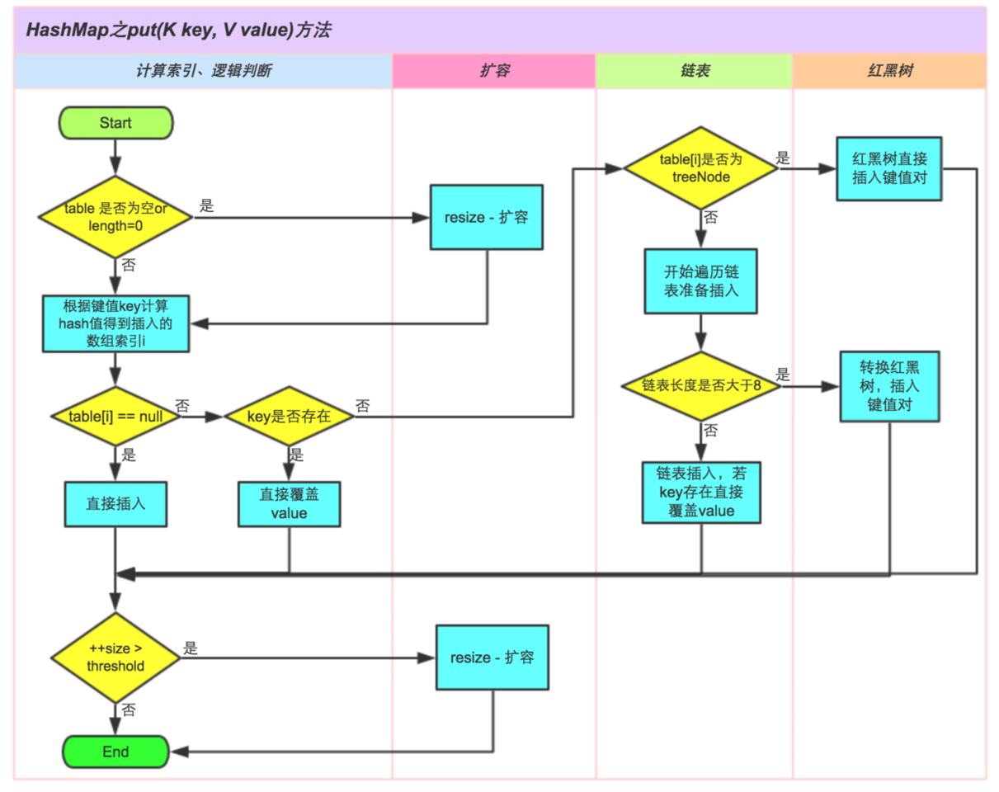

## 1.综述

> - 1.`HashMap`是Java集合框架中使用非常多的一种数据结构
>
> - `HashMap`是基于哈希表`Map`的实现，允许`key`和`value`的值为`null`，存入无序；
>
> - `HashMap`不是线程安全的，没有实现同步
>
>   - 可以利用`Collections.synchronizedMap()`实现`HashMap`的同步
>
> - `HashMap`是一种散列表，在`JDK1.8`中是通过：**数组** + **链表**+**红黑树**来实现的。
>
> - `HahMap`有两个参数影响它的**性能**：**初始容量**和**负载因子**；
>
>   - 默认的负载因子之所以是0.75，是为了时间和空间成本的一种平衡；
>     - 0.75:该参数是泊松分布的参数，按照泊松分布的方式计算得出，在0.75处发生碰撞几率最小；
>
>   

## 2.结构关系

.png)


## 3.属性&内部类

#### 3.1.属性

```java
// 创建 HashMap 时未指定初始容量情况下的默认容量，默认16
static final int DEFAULT_INITIAL_CAPACITY = 1 << 4; // aka 16

// hashmap的最大容量，2的30次方
static final int MAXIMUM_CAPACITY = 1 << 30;

// hashmap默认的负载因子是0.75
static final float DEFAULT_LOAD_FACTOR = 0.75f;

//哈希桶，存放链表。 长度是2的N次方，或者初始化时为0.
  transient Node<K,V>[] table;

// hashmap中关于红黑树的三个参数
// 1.用来确定何时将链表转换为树
static final int TREEIFY_THRESHOLD = 8;

// 2.用来确定何时将树转换为链表
static final int UNTREEIFY_THRESHOLD = 6;

// 3.当链表转换为树时，需要判断下数组的容量，当数组的容量大于这个值时，才树形化该链表；
// 否则会认为链表太长(即冲突太多)是由于数组的容量太小导致的，则不将链表转换为树，而是对数组进行扩容；
static final int MIN_TREEIFY_CAPACITY = 64;
//HashMap中存储的键值对的数量
transient int size;
//扩容阈值，当size>=threshold时，就会扩容
int threshold;
//HashMap的加载因子
final float loadFactor;
```

### 3.2.内部类

##### 3.2.1.Node<K,V>-用来实现数组中的链表的数据结构

```java
// 用来实现数组中链接的数据结构
static class Node<K,V> implements Map.Entry<K,V> {
    final int hash;  // 每个节点的hash值
    final K key;  // 每个节点的key值
    V value;   // 每个节点的value
    HashMap.Node<K, V> next; // 链表中当前节点的下一个节点

    Node(int hash, K key, V value, HashMap.Node<K, V> next) {
        this.hash = hash;
        this.key = key;
        this.value = value;
        this.next = next;
    }
}
```

##### 3.2.2.TreeNode<K,V>-用来实现红黑树的数据结构

```java
// 用来实现红黑树的数据结构
static final class TreeNode<K,V> extends LinkedHashMap.Entry<K,V> {
    HashMap.TreeNode<K, V> parent;  // 存储当前节点的父节点
    HashMap.TreeNode<K, V> left;    // 存储当前节点的左孩子
    HashMap.TreeNode<K, V> right;   // 存储当前节点的右孩子
    HashMap.TreeNode<K, V> prev;    // 存储当前节点的前一个节点
    boolean red;  // 存储红黑树当前节点的颜色(红，黑)

    TreeNode(int hash, K key, V val, HashMap.Node<K, V> next) {
        super(hash, key, val, next);
    }
}
```

## 4.方法

#### 4.1.put()



#### put（）方法的大致逻辑：

> - 1.是否哈希表是null？
>   -  是！那么直接去扩容哈希表，并且将扩容后的哈希桶长度赋值给n
> - 2.根据key计算hash插入到数组索引i,判断哈希表的i槽是不是null？
>   - 2.1.否！判断key是否存在？
>     - 2.1.1.是存在！直接覆盖value
>     - 2.1.2.否不存在！
>       - 2.1.2.1.table[i]是不是树节点？
>         - 2.1.2.1.1.是！插入键值对！
>         - 2.1.2.1.2.否！=>遍历链表，链表是否大于8
>           - 2.1.2.1.2.1.是！转为红黑树节点插入。
>           - 2.1.2.1.2.2.否！链表插入！如果Key存在直接覆盖value。
>   - 2.2.是null！直接插入

```java
public V put(K key, V value) {
    return putVal(hash(key), key, value, false, true);
}
```

```java
 final V putVal(int hash, K key, V value, boolean onlyIfAbsent,
                   boolean evict) {
        //tab存放 当前的哈希桶， p用作临时链表节点  
        Node<K,V>[] tab; Node<K,V> p; int n, i;
        //【1】-如果当前哈希表是空的，代表是初始化
        if ((tab = table) == null || (n = tab.length) == 0)
            //那么直接去扩容哈希表，并且将扩容后的哈希桶长度赋值给n
            n = (tab = resize()).length;
        //如果当前index的节点是空的，表示没有发生哈希碰撞。 直接构建一个新节点Node，挂载在index处即可。
        //【2】-这里再啰嗦一下，index 是利用 哈希值 & 哈希桶的长度-1，替代模运算
        if ((p = tab[i = (n - 1) & hash]) == null)
            //【2.1】-如果p是空的直接进行插入
            tab[i] = newNode(hash, key, value, null);
        else {//【2-2】否则 发生了哈希冲突。
            //e
            Node<K,V> e; K k;
            //【2-2-1】如果哈希值相等，key也相等，则是覆盖value操作
            if (p.hash == hash &&
                ((k = p.key) == key || (key != null && key.equals(k))))
                e = p;//将当前节点引用赋值给e
            //【2-2-2】-如果是红黑树节点直接插入键值对
            else if (p instanceof TreeNode)//红黑树暂且不谈
                e = ((TreeNode<K,V>)p).putTreeVal(this, tab, hash, key, value);
            //【2-2-3】-不是覆盖操作，则插入一个普通链表节点
            else {
                //遍历链表
                for (int binCount = 0; ; ++binCount) {
                    if ((e = p.next) == null) {//【2-2-3-1】-遍历到尾部，追加新节点到尾部
                        p.next = newNode(hash, key, value, null);
                        //【2-2-3-1-1】如果追加节点后，链表数量》=8，则转化为红黑树
                        if (binCount >= TREEIFY_THRESHOLD - 1) // -1 for 1st
                            treeifyBin(tab, hash);
                        break;
                    }
                    //2-2-3-2】-如果找到了要覆盖的节点
                    if (e.hash == hash &&
                        ((k = e.key) == key || (key != null && key.equals(k))))
                        break;
                    p = e;
                }
            }
            //【2-2-3-3】-如果e不是null，说明有需要覆盖的节点，
            if (e != null) { // existing mapping for key
                //则覆盖节点值，并返回原oldValue
                V oldValue = e.value;
                if (!onlyIfAbsent || oldValue == null)
                    e.value = value;
                //这是一个空实现的函数，用作LinkedHashMap重写使用。
                afterNodeAccess(e);
                return oldValue;
            }
        }
        //如果执行到了这里，说明插入了一个新的节点，所以会修改modCount，以及返回null。

        //修改modCount
        ++modCount;
        //【3】更新size，并判断是否需要扩容。
        if (++size > threshold)
            resize();
        //这是一个空实现的函数，用作LinkedHashMap重写使用。留给LinkedHashMap扩展。
        afterNodeInsertion(evict);
        return null;
    }
```

##### treeifyBin（）链表转化为树形结构方法

```java
// 链表的树形化方法：如果链表的长度超过了8，则调用该方法
    final void treeifyBin(Node<K,V>[] tab, int hash) {
        int n, index; Node<K,V> e;
        // 1. 如果数组为空 或这 数组的长度小于 进行树形化的阈值(默认64) 就扩容
        if (tab == null || (n = tab.length) < MIN_TREEIFY_CAPACITY)
            resize();
        else if ((e = tab[index = (n - 1) & hash]) != null) {
            // 2. 如果数组中的元素个数超过了阈值，进行树形化，转为红黑树(hd tl 红黑树头尾节点)
            TreeNode<K,V> hd = null, tl = null;
            do {
                // 3. 从链表的第一个节点开始构建树，e是链表的第一个节点
                TreeNode<K,V> p = replacementTreeNode(e, null);
                if (tl == null)
                    hd = p;
                else {
                    p.prev = tl;
                    tl.next = p;
                }
                tl = p;
            } while ((e = e.next) != null);
            // 4. 让数组的第一个元素指向红黑树的头节点，以后这个数组里的元素就是红黑树，而不是链表了
            if ((tab[index] = hd) != null)
                hd.treeify(tab);
        }
    }
```

> 更多参考：[《博客-HashMap的扩容及树化过程》](https://blog.csdn.net/fan2012huan/article/details/51088211)- 很详细 很赞！

#### 小结： 

* 运算尽量都用**位运算**代替，更高效。 
* 对于扩容导致需要新建数组存放更多元素时，除了要将老数组中的元素迁移过来，也记得将老数组中的引用置**null**，以便GC 
* 取下标 是用 哈希值 与运算 （桶的长度-1） i = (n - 1) & hash。 由于桶的长度是2的n次方，这么做其实是等于 一个模运算。但是效率更高 
* 扩容时，如果发生过哈希碰撞，节点数小于8个。则要根据链表上每个节点的哈希值，依次放入新哈希桶对应下标位置。 
* 因为扩容是容量翻倍，所以原链表上的每个节点，现在可能存放在原来的下标，即low位， 或者扩容后的下标，即high位。 high位= low位+原哈希桶容量 
* 利用哈希值 与运算 旧的容量 ，if ((e.hash & oldCap) == 0),可以得到哈希值去模后，是大于等于oldCap还是小于oldCap，等于0代表小于oldCap，应该存放在低位，否则存放在高位。这里又是一个利用位运算 代替常规运算的高效点 
* 如果追加节点后，链表数量>8，则转化为红黑树 
* 插入节点操作时，有一些空实现的函数，用作`LinkedHashMap`重写使用。

#### 4.2.get()

> 1. 首先`hashMap`的数组不为空，否则返回null;
> 2. 直接定位到该节点，比较该节点的第一个元素，如果相等直接返回；
> 3. 如果该节点是红黑树，调用红黑树的`getTreeNode`方法返回；
> 4. 如果该节点是链表，**挨个查询**，匹配完成返回；

```java
public V get(Object key) {
        Node<K,V> e;
        // 通过key计算出hash，然后通过hash和key 调用getNode方法
        return (e = getNode(hash(key), key)) == null ? null : e.value;
    }
    
    final Node<K,V> getNode(int hash, Object key) {
        Node<K,V>[] tab; Node<K,V> first, e; int n; K k;
        // 1. 数组不为空，通过下标定位到节点，如果该节点的第一个元素不为空((n-1)&hash 计算下标)
        if ((tab = table) != null && (n = tab.length) > 0 &&
                (first = tab[(n - 1) & hash]) != null) {
            // 2. 定位到的节点的第一个元素匹配上，直接返回
            if (first.hash == hash && // always check first node
                    ((k = first.key) == key || (key != null && key.equals(k))))
                return first;
            if ((e = first.next) != null) {
                // 3. 如果该节点是红黑树，则调用红黑树的getTreeNode方法来返回
                if (first instanceof TreeNode)
                    return ((TreeNode<K,V>)first).getTreeNode(hash, key);
                // 4. 如果该节点是链表，挨个匹配，匹配完成返回；
                do {
                    if (e.hash == hash &&
                            ((k = e.key) == key || (key != null && key.equals(k))))
                        return e;
                } while ((e = e.next) != null);
            }
        }
        return null;
    }
```

#### 4.3.resize()-扩容函数(重点)

> `resize`时，扩容为原来的2倍，`HashMap`使用新数组代替旧数组，对原有的元素根据hash值重新就算索引位置，重新安放所有对象；`resize`是耗时的操作。
>
> 参考：[《博客-HashMap resize做了些什么》](https://my.oschina.net/placeholder/blog/180069)

```java
final Node<K,V>[] resize() {
        //oldTab 为当前表的哈希桶
        Node<K,V>[] oldTab = table;
        //当前哈希桶的容量 length
        int oldCap = (oldTab == null) ? 0 : oldTab.length;
        //当前的阈值
        int oldThr = threshold;
        //初始化新的容量和阈值为0
        int newCap, newThr = 0;
        //如果当前容量大于0
        if (oldCap > 0) {
            //如果当前容量已经到达上限
            if (oldCap >= MAXIMUM_CAPACITY) {
                //则设置阈值是2的31次方-1
                threshold = Integer.MAX_VALUE;
                //同时返回当前的哈希桶，不再扩容
                return oldTab;
            }//否则新的容量为旧的容量的两倍。 
            else if ((newCap = oldCap << 1) < MAXIMUM_CAPACITY &&
                     oldCap >= DEFAULT_INITIAL_CAPACITY)//如果旧的容量大于等于默认初始容量16
                //那么新的阈值也等于旧的阈值的两倍
                newThr = oldThr << 1; // double threshold
        }//如果当前表是空的，但是有阈值。代表是初始化时指定了容量、阈值的情况
        else if (oldThr > 0) // initial capacity was placed in threshold
            newCap = oldThr;//那么新表的容量就等于旧的阈值
        else {}//如果当前表是空的，而且也没有阈值。代表是初始化时没有任何容量/阈值参数的情况               // zero initial threshold signifies using defaults
            newCap = DEFAULT_INITIAL_CAPACITY;//此时新表的容量为默认的容量 16
            newThr = (int)(DEFAULT_LOAD_FACTOR * DEFAULT_INITIAL_CAPACITY);//新的阈值为默认容量16 * 默认加载因子0.75f = 12
        }
        if (newThr == 0) {//如果新的阈值是0，对应的是  当前表是空的，但是有阈值的情况
            float ft = (float)newCap * loadFactor;//根据新表容量 和 加载因子 求出新的阈值
            //进行越界修复
            newThr = (newCap < MAXIMUM_CAPACITY && ft < (float)MAXIMUM_CAPACITY ?
                      (int)ft : Integer.MAX_VALUE);
        }
        //更新阈值 
        threshold = newThr;
        @SuppressWarnings({"rawtypes","unchecked"})
        //根据新的容量 构建新的哈希桶
            Node<K,V>[] newTab = (Node<K,V>[])new Node[newCap];
        //更新哈希桶引用
        table = newTab;
        //如果以前的哈希桶中有元素
        //下面开始将当前哈希桶中的所有节点转移到新的哈希桶中
        if (oldTab != null) {
            //遍历老的哈希桶
            for (int j = 0; j < oldCap; ++j) {
                //取出当前的节点 e
                Node<K,V> e;
                //如果当前桶中有元素,则将链表赋值给e
                if ((e = oldTab[j]) != null) {
                    //将原哈希桶置空以便GC
                    oldTab[j] = null;
                    //如果当前链表中就一个元素，（没有发生哈希碰撞）
                    if (e.next == null)
                        //直接将这个元素放置在新的哈希桶里。
                        //注意这里取下标 是用 哈希值 与 桶的长度-1 。 由于桶的长度是2的n次方，这么做其实是等于 一个模运算。但是效率更高
                        newTab[e.hash & (newCap - 1)] = e;
                        //如果发生过哈希碰撞 ,而且是节点数超过8个，转化成了红黑树（暂且不谈 避免过于复杂， 后续专门研究一下红黑树）
                    else if (e instanceof TreeNode)
                        ((TreeNode<K,V>)e).split(this, newTab, j, oldCap);
                    //如果发生过哈希碰撞，节点数小于8个。则要根据链表上每个节点的哈希值，依次放入新哈希桶对应下标位置。
                    else { // preserve order
                        //因为扩容是容量翻倍，所以原链表上的每个节点，现在可能存放在原来的下标，即low位， 或者扩容后的下标，即high位。 high位=  low位+原哈希桶容量
                        //低位链表的头结点、尾节点
                        Node<K,V> loHead = null, loTail = null;
                        //高位链表的头节点、尾节点
                        Node<K,V> hiHead = null, hiTail = null;
                        Node<K,V> next;//临时节点 存放e的下一个节点
                        do {
                            next = e.next;
                            //这里又是一个利用位运算 代替常规运算的高效点： 利用哈希值 与 旧的容量，可以得到哈希值去模后，是大于等于oldCap还是小于oldCap，等于0代表小于oldCap，应该存放在低位，否则存放在高位
                            if ((e.hash & oldCap) == 0) {
                                //给头尾节点指针赋值
                                if (loTail == null)
                                    loHead = e;
                                else
                                    loTail.next = e;
                                loTail = e;
                            }//高位也是相同的逻辑
                            else {
                                if (hiTail == null)
                                    hiHead = e;
                                else
                                    hiTail.next = e;
                                hiTail = e;
                            }//循环直到链表结束
                        } while ((e = next) != null);
                        //将低位链表存放在原index处，
                        if (loTail != null) {
                            loTail.next = null;
                            newTab[j] = loHead;
                        }
                        //将高位链表存放在新index处
                        if (hiTail != null) {
                            hiTail.next = null;
                            newTab[j + oldCap] = hiHead;
                        }
                    }
                }
            }
        }
        return newTab;
    }
```


## 5. 其他

#### 5.1.红黑树

>  **红黑树**是一种能自动平衡的**二叉查找树**，一般的二叉查找树的时间复杂度为**O(logn)**，当一般的二叉查找树退化之后会变成一个线性的列表，这个时候它的时间复杂度就变为了**O(n)**。但是由于红黑树本身的红黑着色和自平衡，使得它的时间复杂度最坏为**O(logn)**，而不是**O(n)**，所以JDK1.8才引入了红黑树。

#### 5.2.HashMap并发会发生死循环的问题

> 参考1：@From：[《博客-疫苗：JAVA HASHMAP的死循环》](https://coolshell.cn/articles/9606.html)
>
> 参考2：@From：[《博客-HashMap中的resize以及死链的情况》](https://www.cnblogs.com/wang-meng/p/7582532.html)

#### 5.3.Java 8：HashMap的性能提升（拓展）

> 参考：@From：[《博客-Java 8：HashMap的性能提升》](http://www.importnew.com/14417.html)

### 参考：

> 1.[《博客-Java1.8-HashMap源码解析》](https://www.jianshu.com/p/33e912d0b4ee)-结构很清晰
>
> 2.[《博客-HashMap？面试？我是谁？我在哪》](http://www.importnew.com/31278.html)-带劲儿！
>
> 3.[《博客-Java HashMap工作原理及实现》](https://yikun.github.io/2015/04/01/Java-HashMap%E5%B7%A5%E4%BD%9C%E5%8E%9F%E7%90%86%E5%8F%8A%E5%AE%9E%E7%8E%B0/)
>
> 4.[《博客-面试必备：HashMap源码解析（JDK8）》](https://blog.csdn.net/zxt0601/article/details/77413921)--（6个6）**概要**总结很到位
>
> 5.[《博客-HashMap 源码详细分析(JDK1.8)》](https://segmentfault.com/a/1190000012926722)-能写出这样博客的一定是个妹子！

