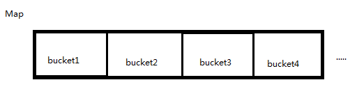
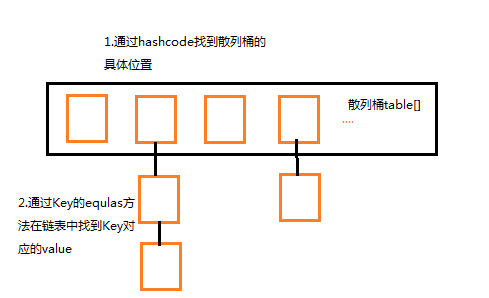
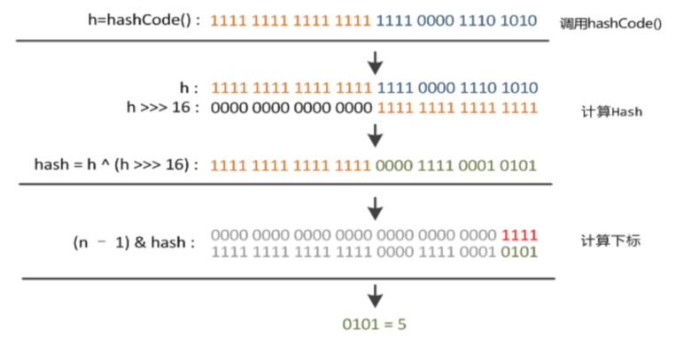
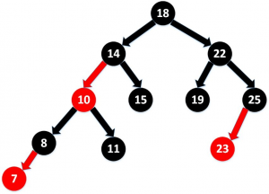

#### 1.为什么用HashMap？

> - 1.HashMap 是一个散列桶（数组和链表），它存储的内容是键值对 key-value 映射
> - 2.HashMap 采用了数组和链表的数据结构，能在查询和修改方便继承了数组的线性查找和链表的寻址修改
> - 3.HashMap 是非 synchronized，所以 HashMap 很快
> - 4.HashMap 可以接受 null 键和值，而 Hashtable 则不能（原因就是 equlas() 方法需要对象，因为 HashMap 是后出的 API 经过处理才可以）

#### 2、HashMap 的工作原理是什么？

**HashMap 是基于 hashing 的原理**

我们使用 put(key, value) 存储对象到 HashMap 中，使用 get(key) 从 HashMap 中获取对象。当我们给 put() 方法传递键和值时，我们先对键调用 hashCode() 方法，计算并返回的 hashCode 是用于找到 Map 数组的 bucket 位置来储存 Node 对象。

这里关键点在于指出，HashMap 是在 bucket 中储存键对象和值对象，作为Map.Node 。

[](http://www.importnew.com/31278.html/1294463-20181119000932124-498988644)

**以下是 HashMap 初始化**

简化的模拟数据结构：

```java
`Node[] table = ``new` `Node[``16``]; ``// 散列桶初始化，table``class` `Node {``    ``hash; ``//hash值``    ``key; ``//键``    ``value; ``//值``    ``node next; ``//用于指向链表的下一层（产生冲突，用拉链法）``}`
```

**以下是具体的 put 过程（JDK1.8）**

1. 对 Key 求 Hash 值，然后再计算下标
2. 如果没有碰撞，直接放入桶中（碰撞的意思是计算得到的 Hash 值相同，需要放到同一个 bucket 中）
3. 如果碰撞了，以链表的方式链接到后面
4. 如果链表长度超过阀值（TREEIFY THRESHOLD==8），就把链表转成红黑树，链表长度低于6，就把红黑树转回链表
5. 如果节点已经存在就替换旧值
6. 如果桶满了（容量16*加载因子0.75），就需要 resize（扩容2倍后重排）

**以下是具体 get 过程**

**考虑特殊情况：**如果两个键的 hashcode 相同，你如何获取值对象？

当我们调用 get() 方法，HashMap 会使用键对象的 hashcode 找到 bucket 位置，找到 bucket 位置之后，会调用 keys.equals() 方法去找到链表中正确的节点，最终找到要找的值对象。

[](http://www.importnew.com/31278.html/1294463-20181119002141457-19724606)

#### 3、有什么方法可以减少碰撞？

- **扰动函数可以减少碰撞**
  - 原理是如果两个不相等的对象返回不同的 hashcode 的话，那么碰撞的几率就会小些。这就意味着存链表结构减小，这样取值的话就不会频繁调用 equal 方法，从而提高 HashMap 的性能（扰动即 Hash 方法内部的算法实现，目的是让不同对象返回不同hashcode）。

- **使用不可变的、声明作 final 对象，并且采用合适的 equals() 和 hashCode() 方法，将会减少碰撞的发生**
  - 不可变性使得能够缓存不同键的 hashcode，这将提高整个获取对象的速度，使用 String、Integer 这样的 wrapper 类作为键是非常好的选择。

**为什么 String、Integer 这样的 wrapper 类适合作为键？**

- 因为 String 是 final，而且已经重写了 equals() 和 hashCode() 方法了。不可变性是必要的，因为为了要计算 hashCode()，就要防止键值改变，如果键值在放入时和获取时返回不同的 hashcode 的话，**那么就不能从 HashMap 中找到你想要的对象**。

#### 4.HashMap 中 hash 函数怎么是实现的?

我们可以看到，在 hashmap 中要找到某个元素，需要根据 key 的 hash 值来求得对应数组中的位置。如何计算这个位置就是 hash 算法。(找到数组位置)

前面说过，hashmap 的数据结构是数组和链表的结合，所以我们当然希望这个 hashmap 里面的元素位置尽量的分布均匀些，尽量使得每个位置上的元素数量只有一个。那么当我们用 hash 算法求得这个位置的时候，马上就可以知道对应位置的元素就是我们要的，而不用再去遍历链表。 所以，我们首先想到的就是把 hashcode 对数组长度取模运算。这样一来，元素的分布相对来说是比较均匀的。

但是“模”运算的消耗还是比较大的，能不能找一种更快速、消耗更小的方式？我们来看看 JDK1.8 源码是怎么做的（被楼主修饰了一下）

```java
`static` `final` `int` `hash(Object key) {``    ``if` `(key == ``null``){``        ``return` `0``;``    ``}``    ``int` `h;``    ``h = key.hashCode()；返回散列值也就是hashcode``    ``// ^ ：按位异或``    ``// >>>:无符号右移，忽略符号位，空位都以0补齐``    ``//其中n是数组的长度，即Map的数组部分初始化长度``    ``return` `(n-``1``)&(h ^ (h >>> ``16``));``}`
```

[](http://www.importnew.com/31278.html/1294463-20181119224252423-2018084724)

简单来说就是：

- 高16 bit 不变，低16 bit 和高16 bit 做了一个异或（得到的 hashcode 转化为32位二进制，前16位和后16位低16 bit和高16 bit做了一个异或）
- (n·1) & hash = -> 得到下标

#### 5、拉链法导致的链表过深，为什么不用二叉查找树代替而选择红黑树？为什么不一直使用红黑树？

>  之所以选择红黑树是为了解决二叉查找树的**缺陷**：二叉查找树在特殊情况下会变成一条线性结构（这就跟原来使用链表结构一样了，造成**层次很深**的问题），**遍历查找会非常慢**。而红黑树在插入新数据后可能需要通过左旋、右旋、变色这些操作来保持平衡。引入红黑树就是为了**查找数据快**，**解决链表查询深度的问题**。我们知道红黑树属于平衡二叉树，为了保持“平衡”是需要付出代价的，但是该代价所损耗的资源要比遍历线性链表要少。所以当长度大于8的时候，会使用红黑树；如果链表长度很短的话，根本不需要引入红黑树，引入反而会慢。

#### 6、说说你对红黑树的见解？

[](http://www.importnew.com/31278.html/1294463-20181119224633228-1433434325)

> 1. 每个节点非红即黑
> 2. 根节点总是黑色的
> 3. 如果节点是红色的，则它的子节点必须是黑色的（反之不一定）
> 4. 每个叶子节点都是黑色的空节点（NIL节点）
> 5. 从根节点到叶节点或空子节点的每条路径，必须包含相同数目的黑色节点（即相同的黑色高度）

#### 7、解决 hash 碰撞还有那些办法？

> #### 开放定址法
>
> 当冲突发生时，使用某种探查技术在散列表中形成一个探查（测）序列。沿此序列逐个单元地查找，直到找到给定的地址。按照形成探查序列的方法不同，可将开放定址法区分为**线性探查法、二次探查法、双重散列法**等。
>
> 下面给一个线性探查法的例子：
>
> **问题：**已知一组关键字为 (26，36，41，38，44，15，68，12，06，51)，用除余法构造散列函数，用线性探查法解决冲突构造这组关键字的散列表。
> **解答：**为了减少冲突，通常令装填因子 α 由除余法因子是13的散列函数计算出的上述关键字序列的散列地址为 (0，10，2，12，5，2，3，12，6，12)。
> 前5个关键字插入时，其相应的地址均为开放地址，故将它们直接插入 T[0]、T[10)、T[2]、T[12] 和 T[5] 中。
> 当插入第6个关键字15时，其散列地址2（即 h(15)=15％13=2）已被关键字 41（15和41互为同义词）占用。故探查 h1=(2+1)％13=3，此地址开放，所以将 15 放入 T[3] 中。
> 当插入第7个关键字68时，其散列地址3已被非同义词15先占用，故将其插入到T[4]中。
> 当插入第8个关键字12时，散列地址12已被同义词38占用，故探查 hl=(12+1)％13=0，而 T[0] 亦被26占用，再探查 h2=(12+2)％13=1，此地址开放，可将12插入其中。
> 类似地，第9个关键字06直接插入 T[6] 中；而最后一个关键字51插人时，因探查的地址 12，0，1，…，6 均非空，故51插入 T[7] 中。

#### 8.如果 HashMap 的大小超过了负载因子（load factor）定义的容量怎么办？

> HashMap 默认的负载因子大小为0.75。也就是说，当一个 Map 填满了75%的 bucket 时候，和其它集合类一样（如 ArrayList 等），将会创建原来 HashMap 大小的两倍的 bucket 数组来重新调整 Map 大小，并将原来的对象放入新的 bucket 数组中。这个过程叫作 **rehashing**。
>
> 因为它调用 hash 方法找到新的 bucket 位置。这个值只可能在两个地方，一个是原下标的位置，另一种是在下标为 **<原下标+原容量>** 的位置。

#### 9、重新调整 HashMap 大小存在什么问题吗？

> 因为如果两个线程都发现 HashMap 需要重新调整大小了，它们会同时试着调整大小。在调整大小的过程中，存储在链表中的元素的次序会反过来。因为移动到新的 bucket 位置的时候，HashMap 并不会将元素放在链表的尾部，而是放在头部。这是为了避免尾部遍历（tail traversing）。如果条件竞争发生了，那么就**死循环**了。多线程的环境下不使用 HashMap。

##### 为什么多线程会导致死循环，它是怎么发生的？

> HashMap 的容量是有限的。当经过多次元素插入，使得 HashMap 达到一定饱和度时，Key 映射位置发生冲突的几率会逐渐提高。这时候， HashMap 需要扩展它的长度，也就是进行Resize。
>
> 1. 扩容：创建一个新的 Entry 空数组，长度是原数组的2倍
> 2. rehash：遍历原 Entry 数组，把所有的 Entry 重新 Hash 到新数组
>
> （这个过程比较烧脑，暂不作流程图演示，有兴趣去看看我的另一篇博文“[HashMap扩容全过程](https://www.cnblogs.com/zhuoqingsen/p/8577646.html)”）

#### 10.HashMap 与 HashTable 区别

> - 默认容量不同，扩容不同
> - 线程安全性：HashTable 安全
> - 效率不同：HashTable 要慢，因为加锁

## 参考：

> From：[《博客-HashMap？面试？我是谁？我在哪》](http://www.importnew.com/31278.html)-【01-10】


